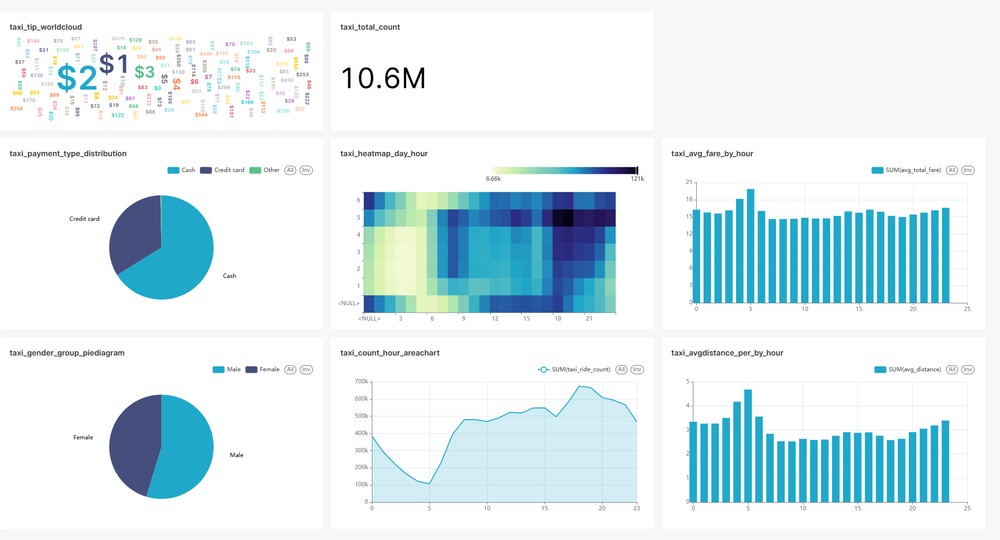
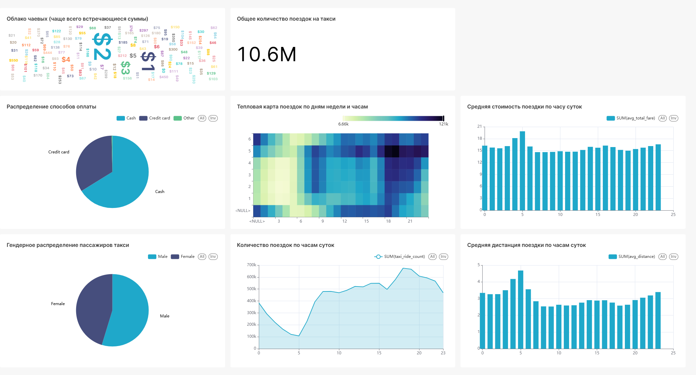

# 🚴‍♀️ Bike vs 🚕 Taxi: Аналитика городского транспорта NYC

Аналитический проект по сравнению поведения пользователей городского велопроката и такси в Нью-Йорке.

## 📂 Описание проекта

Проект выполнен в рамках стажировки. Основные этапы работы:

- Очистка и предобработка больших датасетов (более 2 ГБ каждый)
- Загрузка данных в PostgreSQL
- Построение интерактивных дашбордов в Apache Superset
- Анализ сезонности, географии, времени использования транспорта

## 🔧 Используемые технологии

- 🐍 Python (pandas, Jupyter Notebook)
- 🐘 PostgreSQL
- 📊 Apache Superset
- 📁 Git, GitHub

## 📁 Структура проекта

bike-vs-taxi-analytics/
│
├── forBikes.ipynb # Анализ поездок на велосипедах
├── forTaxi.ipynb # Анализ заказов такси
├── superset_config.py # Конфигурация Superset (API ключ Mapbox)
├── .gitignore
└── README.md

## 📈 Примеры дашбордов





## 🚀 Как запустить

1. Установить зависимости: PostgreSQL, Superset
2. Настроить `superset_config.py` с собственным Mapbox API ключом
3. Запустить Superset:
   ```bash
   export FLASK_APP=superset
   export SUPERSET_CONFIG_PATH=~/superset_config.py
   superset run -h 127.0.0.1 -p 8088
